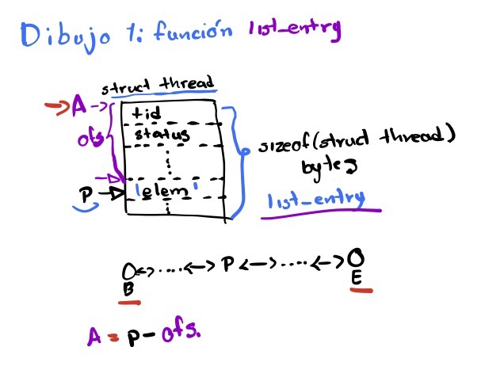
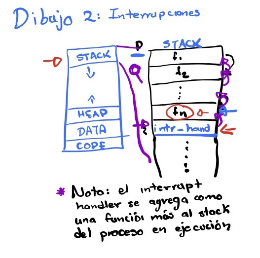
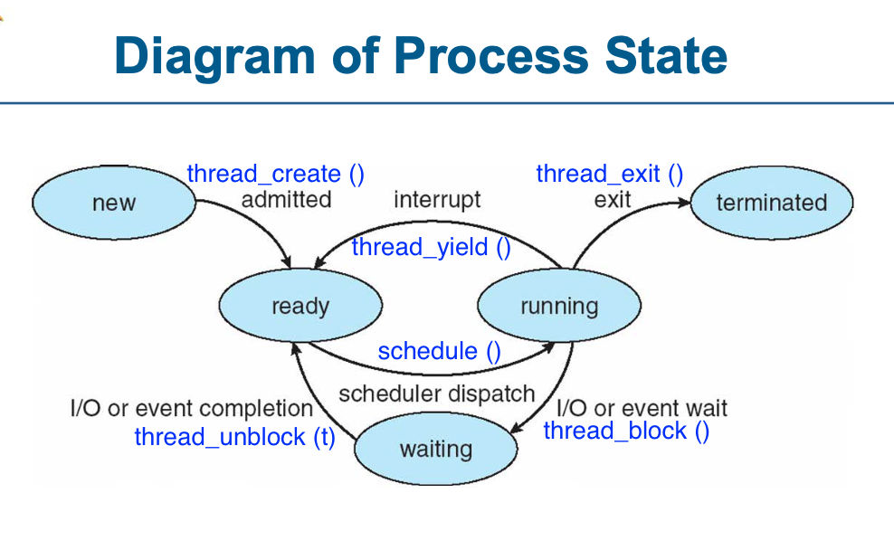

# Pintos: Scheduler de Prioridades

## Funcionamiento de listas

Dibujo 1: `list_entry ()` calcula la dirección donde inicia el _struct thread_ a partir de la dirección del _list_elem_ `elem` que este contiene.



## Funcionamiento de interrupciones

Dibujo 2: el proceso en ejecución (`thread_current ()`), agrega a su _stack_ de ejecución el interrupt handler de la interrupción que sucedió y salta a ejecutar dicha función.



## Funciones y variables globales involucradas en el funcionamiento del scheduler

* `ready_list`: los procesos en estado `THREAD_READY`

* `idle_thread`: el que corre cuando la `ready_list` está vacía

* `thread_tick ()`: que se ejecuta como último paso una vez cada tick, ojo es una subrutina del interrupt handler del timer. Si el proceso actual ya se ha ejecutado `TIME_SLICE` (4) ticks, debe de ceder el procesador.

* `thread_yield ()`: el proceso en ejecución ()`THREAD_RUNNING`) cede el procesador, es decir, pasa a estado `THREAD_READY` (se vuelve a formar en al `ready_list`).

* `intr_yield_on_return ()`: es igual a `thread_yield`, pero esta es la función que tenemos que llamar si estamos ejecutando un _interrupt handler_, al final del interrupt handler el proceso
`thread_yield`.

* `intr_context ()`: regresa _true_ si el proceso se encuentra ejecutando algún interrupt handler de asociado con un dispositivo de hardware (ej. el _timer_), _false_ en caso contrario.

* `schedule ()`: elige el siguiente proceso a ejecutar del `ready_list` y luego realiza el cambio de contexto mediante la función `switch_threads (cur, next)`

* `thread_ticks`: es una variable global que cuenta cuantos ticks ha estado en ejecución (`THREAD_RUNNING`) el proceso actual.

* Nota: El scheduler de pintos por omisión es _Round Robing_

* `thread_block ()`: pasa un proceso de estado `THREAD_RUNNING` a estado `THEAD_BLOCKED` (waiting).

* `thread_unblock (t)`: pasa un proceso de estado `THREAD_BLOCKED` a estado `THREAD_READY`.



## Solución de la práctica

Una opción para implementar el scheduler de prioridades es mantener
la lista ordenada descendentemente con respecto a la prioridad,
para esto modificamos las funciones que modifican el contenido de
la `ready_list`.

Lugares donde agregamos un _thread_ a la `ready_list`:
* `thread_unblock (t)`
* `thread_yield ()`

Lugares donde sacamos un _thread_ de la `ready_list`:
* `next_thread_to_run ()`

Para que el scheduler de prioridades sea _preemtive_, necesitamos
modificar el código de `thread_unblock (t)`, de tal forma que si el
hilo `t` tiene mayor prioridad que el hilo en ejecución (`thread_current ()`), entonces este cede el procesador (thread_yield / intr_yield_on_return).
   
`thread_set_priority (new_priority)`: si el hilo deja de ser el de mayor prioridad debe de ceder el procesador (thread_yield / intr_yield_on_return)

_Nota_: En el archivo `src/threads/synch.c` en la implementación de la función `sema_up` hay que sustituir la implementación original:

```c
void sema_up (struct semaphore *sema) {
  enum intr_level old_level;

  ASSERT (sema != NULL);

  old_level = intr_disable ();
  if (!list_empty (&sema->waiters)) 
    thread_unblock (list_entry (list_pop_front (&sema->waiters),
                                struct thread, elem));
  sema->value++;
  
  intr_set_level (old_level);
}
```

Por la siguiente implementación:

```c
void sema_up (struct semaphore *sema) {
  enum intr_level old_level;

  ASSERT (sema != NULL);

  old_level = intr_disable ();
  // la siguiente linea tiene que ir antes de que saquemos a un proceso de la lista de espera del semáforo
  sema->value++; 
  if (!list_empty (&sema->waiters)) 
    thread_unblock (list_entry (list_pop_front (&sema->waiters),
                                struct thread, elem));
  intr_set_level (old_level);
}
```

Si no se hace este cambio en el momento en el que scheduler de prioridades soporta preemption se va a trabjar el sistema operativo debido a una _race condition_.